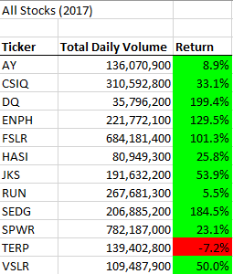
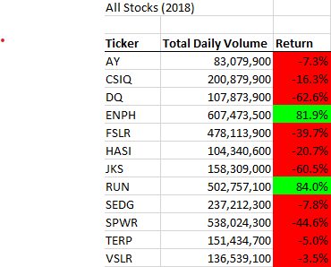
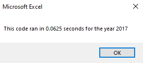
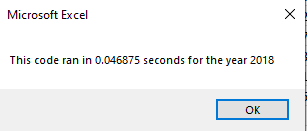

# Stock Analysis

  

## Overview of Project

  

### Purpose
The purpose of this analysis is to give our client, Steve, a tool to analyze the stock market from the last few years. While this has been accomplished in previous lessons, the goal is to refactor our code to have adequate runtime when dealing with larger data sets like the stock market.

  

## Results

The analysis of a dozen stocks from the years 2017 and 2018 involved finding the TDV (**Total Daily Volume**) and the **Return**. The TDV is simply a running sum of the volume for a given ticker. The return is found by diving the last close value by the starting close value for a given ticker and then subtracting 1. The results for each year can be seen below:

While the stock results for each year are interesting it's not really what we're here to discuss. Rather, we should be taking  look at the run time:

  
As can be seen from the images, the analysis of 2018 performed faster than the analysis of 2017.
## Summary
When it comes to coding, there are likely to be many reasons someone writes the code the way they did. Maybe you're on a deadline and just need to get something out the door into production so you opt to write something a bit messy but still works. You'd probably hope to refactor that code at a later date. Refactoring is not always doable though, it has its advantages and disadvantages. On the pro side, you can make your code more efficient whether that be just a faster runtime or less memory used. On the con side, just because your code is more efficient does mean it's more readable. Comments can certainly help with readability but they can only do so much. Also, time just may not allow for refactoring.

Comparing the original and refactored script, I consider it to be almost entirely an improvement. The refactored script is more efficient since there is no nested for loop. However, I do find the original to be very slightly more readable but it's really not much of a difference. I also like the that the original has the formatting separated into a separate subroutine; it keeps things more organized. That being said, I think that those are worthwhile trades for the efficiency.
